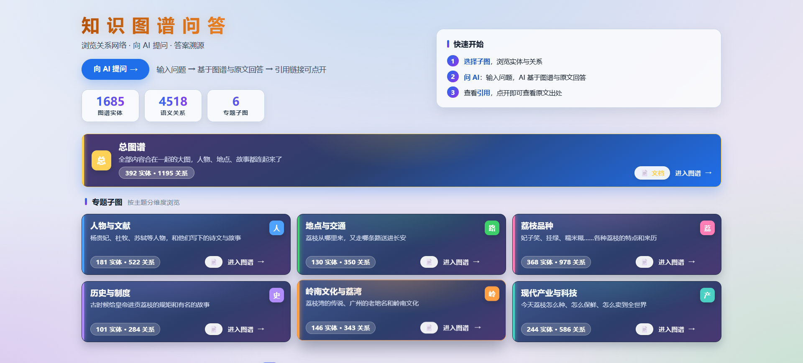
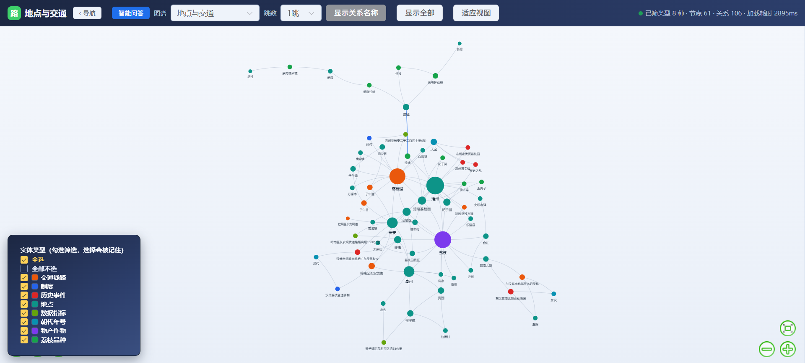
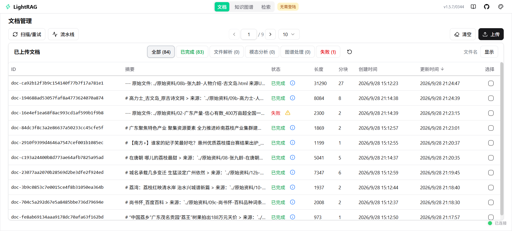
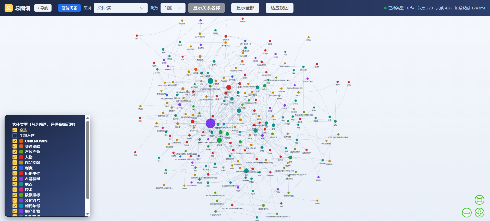
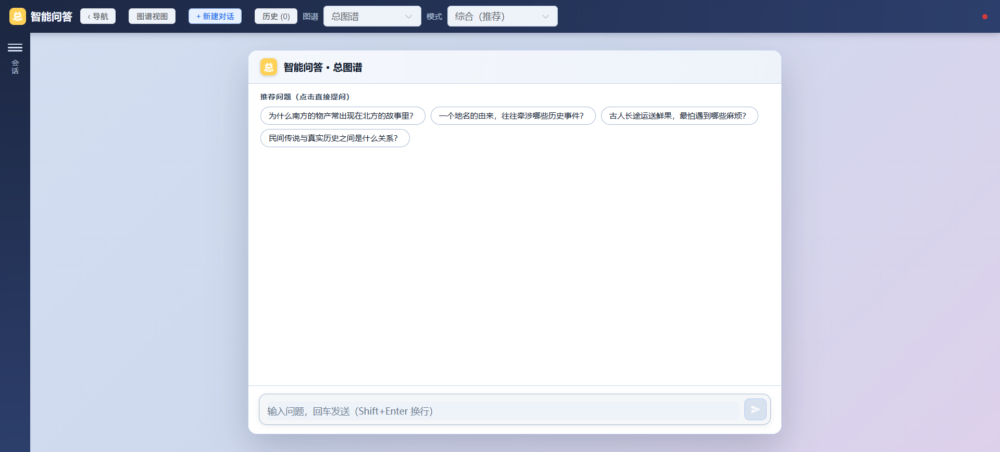

# 用户使用说明书

本说明书介绍系统的所有功能使用流程，按下面步骤一步步操作即可。

---

## 1. 系统能做什么

整个系统分为三大功能：

1. **看图谱** —— 把知识画成一张"关系网"，圆点是人和事，连线是它们之间的关系
2. **问 AI** —— 用日常话提问，AI 会查原文 + 知识图谱后回答，并把原文出处标出来
3. **管文档** —— 上传自己的资料，让 AI 学习你的内容后再回答问题

---

## 2. 打开网站

通过老师/同学分享的链接打开本系统，进入后看到的是这样的界面：

| 位置 | 是什么 |
|---|---|
| 左上角大字 | 网站名字：「知识图谱问答」 |
| 左上角按钮「向 AI 提问 →」 | 点击直接进入 AI 问答页 |
| 三个数字 | 图谱里的「实体」「关系」「专题子图」总数 |
| 右上角「快速开始」 | 三步走说明，按顺序操作即可 |
| 中间大卡片「总图谱」 | 点击进入完整的知识图谱 |
| 下面 6 个小卡片 | 6 个不同主题的子图，每个专题不同 |

---

## 3. 看图谱

### 3.1 看「总图谱」

点击首页中间那张 **「总图谱」** 大卡片，会新开一个标签页，显示如下：

页面上有以下按钮：

| 按钮 | 干什么用 |
|---|---|
| **‹ 导航** | 返回首页 |
| **智能问答** | 直接跳到 AI 问答页 |
| **图谱：总图谱**（下拉） | 切换不同子图（总图谱 / 人物与文献 / 荔枝品种 …） |
| **跳数：1跳**（下拉） | 控制展开范围。**1 跳**只显示关系最近的，**2 跳、3 跳**展开更多 |
| **显示关系名称** | 在连线上显示"是谁和谁有什么关系" |
| **显示全部** | 重置图，恢复全貌 |
| **适应视图** | 图太大或太小了点这个，自动缩放到屏幕大小 |

左下角有一个 **「实体类型」** 列表，每个类型前面有个小方框。

- **勾上** = 在图上显示这种类型（比如只勾"人物"，图上就只剩人物）
- **取消勾** = 隐藏这种类型
- 不知道勾什么？**保持全勾**就行，那是看全部的样子

### 3.2 看「子图」

首页下面 6 张小卡片就是 6 个子图。每个子图就是总图谱的一部分，按主题分开看更清楚：

- **人物与文献**：杨贵妃、杜牧、苏轼这些人和他们写的诗
- **地点与交通**：荔枝从哪里来、怎么送到长安
- **荔枝品种**：妃子笑、挂绿、糯米糍这些品种的特点
- **历史与制度**：古时候怎么给皇帝送荔枝
- **岭南文化与荔湾**：广州荔枝湾的故事、岭南文化
- **现代产业与科技**：今天怎么种、怎么卖到全世界

点击任何一张小卡片（比如「荔枝品种」），会自动打开对应的子图。

界面和总图谱一样，工具栏在上面，左下图例也在同样位置。

### 3.3 看图时的小技巧

- **想看清楚一个点**：滚轮往上滚（放大），往下滚（缩小）
- **图偏到一边去了**：按住空白处**拖**回来
- **想看一个点的详细信息**：**单击**那个点 → 右边会弹出这个点的资料和原文
- **想以某个点为中心**：**双击**那个点，图会自动重新画

---

## 4. 管文档（上传自己的资料）

### 4.1 进入文档管理

首页上**每个卡片**上都有一个 **「📄 文档」** 按钮：

- 点击某个卡片上的「📄 文档」按钮，即可进入该专题的文档管理页
- 文档管理在**新标签页**中打开，不会关闭首页

打开后是这样的界面：

页面顶部有几个标签可以切换（点击对应标签即可跳转）：

| 标签 | 点击后去往 |
|---|---|
| **文档** | 当前页面（文档管理） |
| **知识图谱** | 返回首页（图谱浏览） |
| **检索** | 知识库全文检索（找某段原文） |

### 4.2 上传文档

打开文档管理页后：

1. 点击页面**右上角的「↑ 上传」按钮**
2. 选择电脑里的文件（支持 .txt、.pdf、.docx、.md、.html 等）
3. 几秒后，文件会出现在列表里

> 提示：上传完别急着问 AI，AI 需要时间"读完"你的资料。

### 4.3 查看文档处理状态

列表中间的 **「已上传文档 / 已完成 / 文件解析 / 模态分析 / 图谱处理 / 失败」** 标签是分类筛选，点击只看某一类。

每个文档都有一个**状态标签**：

| 状态 | 含义 |
|---|---|
| 🟢 **已完成** | AI 已经读完这份文档，可以基于它回答问题了 |
| 🟡 处理中（文件解析 / 模态分析 / 图谱处理） | AI 还在读，再等一会 |
| 🔴 **失败** | 处理出错，可能是格式不支持 |

---

## 5. 问 AI（智能问答）

### 5.1 进入智能问答

- 点击首页左上角 **「向 AI 提问 →」** 大按钮（最快）
- 或者点击图谱页右上角 **「智能问答」** 按钮

打开后看到的是这样的界面：

页面上有以下元素：

| 位置 | 是什么 |
|---|---|
| 顶部「智能问答 · 总图谱」 | 当前问答所在的主题子图 |
| 「+ 新建对话」按钮 | 开启一段全新的对话 |
| 「历史 (0)」按钮 | 查看/切换历史对话 |
| 主题下拉（如「总图谱」） | 切换问答所在的主题 |
| 模式（默认「综合(推荐）」） | 切换 AI 的检索方式（见 5.3） |
| 「推荐问题」按钮 | 直接点击就能问示例问题 |
| 最下方输入框 | 在这里输入问题 |

### 5.2 提问步骤

1. 在最下方的输入框中输入问题
2. 按 **回车** 发送（直接发送，不换行）
3. 想换行 → 按 **Shift + 回车**

> AI 会**一个字一个字冒出来**（打字机效果），不等它全部打完你就能开始看。

### 5.3 提问模式选择

页面上方有一个 **「模式」下拉**，点击展开：

| 选项 | 什么时候用 |
|---|---|
| **综合（推荐）** | **大部分问题选这个**。AI 同时查知识图谱 + 原文，回答最全 |
| **纯原文** | **只用原文回答**，不查图谱。问"原文里怎么写的" |
| 混合检索 / 局部上下文 / 全局话题 / 只检索不生成 | 其他检索方式，按需选择 |

### 5.4 提问小技巧

**问得越具体，AI 答得越好**：

| ❌ 不太好 | ✅ 更好 |
|---|---|
| "讲讲荔枝" | "杨贵妃吃的荔枝来自哪里？" |
| "谁" | "谁把荔枝推荐给杨贵妃？" |
| "在哪" | "高州贡园在哪个省？树有多老？" |

**对比类问题也很好用**：
> "杨贵妃吃的荔枝 vs 苏轼日啖三百颗的荔枝，有什么不同？"

AI 会**跨子图**自动查找答案。

### 5.5 查看引用（最有用的部分）

AI 回答里会出现一些**上标数字**，比如 `[1] [2] [3]`。

| 操作 | 效果 |
|---|---|
| **鼠标悬停**在数字上 | 弹出一个小气泡，显示该段落的**原文** |
| **点击**数字 | 跳转到该段落的**原网页**（PDF 在浏览器里直接打开） |

> 你可以点开看到 AI 是从哪段话里找到答案的，AI 说得对不对都能在原文里核对。

### 5.6 查看历史对话

所有对话都会**自动保存在这个浏览器里**（不会上传到任何地方）：

- 页面**最左边**有一条窄边，点击上面的 **「☰」** 图标展开
- 展开后是历史对话列表，按主题分组
- **点击某条对话** → 切换到那个对话继续问
- **双击对话标题** → 可以改名

---

## 6. 顶部导航栏说明

任何页面顶部都有这些标签：

| 标签 | 作用 |
|---|---|
| **文档** | 进入文档管理页（上传 / 查看文档状态） |
| **知识图谱** | 返回首页（图谱浏览） |
| **检索** | 知识库全文检索（找某段原文） |
| **无需登陆** | 当前状态显示，网站无需账号密码 |

---

## 7. 功能速查表

| 我想做的事 | 在哪里点 |
|---|---|
| 看完整的知识图谱 | 首页 → 点击「总图谱」卡片 |
| 看某个专题 | 首页 → 点击对应小卡片 |
| 上传资料 | 文档管理页 → 右上角「↑ 上传」 |
| 查看资料处理进度 | 文档管理页 → 看列表里的状态标签 |
| 问 AI 问题 | 首页左上「向 AI 提问」或图谱页「智能问答」 |
| 切换 AI 模式 | 智能问答页右上「模式」下拉 |
| 查看 AI 引用的原文 | 鼠标悬停回答里的 `[n]` |
| 返回首页 | 任何页面点击「‹ 导航」按钮 |

---

## 8. 遇到问题怎么办

**页面打不开 / 白屏**
- 检查网络连接
- 换个浏览器试试（推荐 Chrome / Edge）
- 联系老师或同学

**AI 回答很慢 / 转圈**
- 第一次进入页面需要加载数据，等待 10-30 秒
- 切换子图也会重新加载
- 超过 2 分钟没反应 → 刷新页面（按 F5）

**回答里没出现 `[n]` 引用**
- 某些泛泛的问题 AI 可能不引用
- 把问题改得更具体，或切换到「综合（推荐）」模式

**点开引用打不开原网页**
- 原文是 PDF 或图片时，会在浏览器里直接打开
- 提示 404 说明原网页已下架，但引用证据本身仍有效

**历史对话不见了**
- 历史只存在**当前浏览器**里
- 换浏览器、清缓存、用无痕窗口 → 历史不会同步
- 这是为了保护隐私

---

## 9. 一句话总结

整个系统就**三个动作**：首页 → 看图谱 / 问 AI / 管文档。
其余按钮都是辅助操作，可以放心尝试。